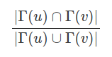

## SNA Link Prediction
A packahge for link prediction in social network analysis. It fits on the given edges, which is a pandas dataframe consisting of two columns containing node numbers, and each row represents one edge. Later it predicts for other set of given edges. The output consists of 1's and 0's, where 1 shows that there is a node, and 0 that there is no node.

In our model the created features are created using the same data of edges, and because of that during training there would be feature interaction. Because of that I used Random Forest Classifier, where feature interaction isn't so problematic.

Used features include
1. Common Neoghbors 

    
2. Jaccard Coefficient

    
3. Resource Allocation

    
4. Adamic Adar Index

    
5. Preferential Attachement

    
6. Shortest Path

$Г(x)$ and $N(x)$ denotes the set on neighbors of $x$.